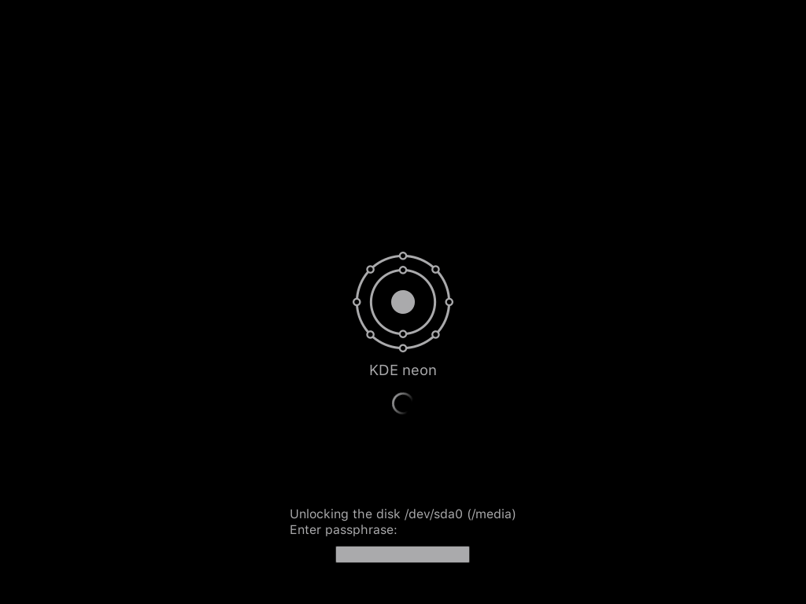

# Monochrome Plymouth

<p align="center">
    
</p>

## :information_source: About
Monochrome Plymouth is a fork of the well known [Breeze Plymouth](https://github.com/KDE/breeze-plymouth) theme created by [KDE](https://www.kde.org/). This fork was created to complement the [Monochrome KDE](https://gitlab.com/pwyde/monochrome-kde) theme for the Plasma desktop environment.

The original theme has been modified with the following:

- Custom colour palette.
- Added support for custom fonts.
  - Partial support using the provided install [script](install.sh). See [details](README.md#details) below.
- Modified graphical elements.
- Removed 16bit framebuffer/output support.
- Support for automatic change of distribution logotype.
  - Partial support using the provided install [script](install.sh). See [details](README.md#details) below.

### Details
To work properly, the theme depends on that all the necesary files are included into the **initramfs** image. This is accomplished with the help of *build hooks*, which are sourced by the shell during runtime of *mkinitcpio* or *mkinitramfs* (depending on distribution).

The original theme uses the Plymouth *[label](https://github.com/Jolicloud/plymouth/tree/master/src/plugins/controls/label)* [plugin](https://github.com/Jolicloud/plymouth/tree/master/src/plugins) to display text elements. Hence it must be added into the initramfs image along with its dependencies (i.e. [Pango](https://www.pango.org/)). This is not performed on all distributions. Arch Linux for example, does not and is solved by the Arch Linux specific [hook](hooks/monochrome-plymouth).

To utilize the custom font support in the theme, font releated files must also be included into the initramfs image. The provided install [script](install.sh) tries to identify the distribution in use and install the required build [hook](hooks) for that particular distribution. If no custom font is specified, the default font *Noto Sans* will be used. Since this theme was created to complement the Plasma theme [Monochrome KDE](https://gitlab.com/pwyde/monochrome-kde), it is assumed that [Noto](https://www.google.com/get/noto/) fonts are already installed.

The install [script](install.sh) will also automatically change which logotype to display depending on which distribution is identified.

See [limitations](README.md#limitations) below for more information and which distributions are supported.

## Limitations
At the time of writing not all distributions are supported, see list below. This is due to the fact that the theme relies on distribution specific build hooks.

**Linux Distribution Compaility**

| **Distribution**                                  | **Supported**      |
|:--------------------------------------------------|:------------------:|
| [Arch Linux](https://www.archlinux.org/)          | :heavy_check_mark: |
| [CentOS](https://www.centos.org/)<sup>*</sup>     | :x:                |
| [Debian](https://www.debian.org/)<sup>*</sup>     | :x:                |
| [Fedora](https://getfedora.org/)<sup>*</sup>      | :x:                |
| [KDE Neon](https://neon.kde.org/)                 | :heavy_check_mark: |
| [Kubuntu](https://kubuntu.org/)<sup>*</sup>       | :x:                |
| [Manjaro](https://manjaro.org/)                   | :heavy_check_mark: |
| [openSUSE](https://www.opensuse.org/)<sup>*</sup> | :x:                |
| [Ubuntu](https://ubuntu.com/)<sup>*</sup>         | :x:                |

<sup>*</sup>Support for distribution will hopefully be added in the future.

### Fonts
If a custom font is specified, the source font file __must__ be located in the system fonts location of `/usr/share/fonts`. Otherwise the theme will not work properly. User specific font locations such as `~/.fonts` is not supported.

## :floppy_disk: Install Instructions
At the time of writing there are no packages available. Install the theme manually using `git clone` and see below for further instructions.

### Install Script
The installation script will automatically download the latest version from the repository and copy the required files to the default location `/usr/share`. Distribution specific modifications such as logotype is automatically performed by the install script. See [limitations](README.md#limitations) before installing!

#### Install
```
$ bash install.sh --install
```

#### Uninstall
```
$ bash install.sh --uninstall
```

#### Install with custom font
```
$ bash install.sh --install --font /usr/share/fonts/TTF/DejaVuSans.ttf
```

#### Options
| **Option**         | **Description**                                                                        |
| ---                | ---                                                                                    |
| `-i`,`--install`   | Install theme in default location (`/usr/share`).                                      |
| `-u`,`--uninstall` | Uninstall theme.                                                                       |
| `-f`,`--font`      | Specify custom font to use. If not specified, *Noto Sans* will be used as the default. |
| `-h`,`--help`      | Display help message including available options.                                      |

### Arch Linux & Manjaro
After using the install script, add the custom build hook `monochrome-plymouth` to the `HOOKS` array in the `/etc/mkinitcpio.conf` configuration file.

```
HOOKS=(... monochrome-plymouth)
```

Regenerate the initial ramdisk with command below.

```
# mkinitcpio -p linux
```

### KDE Neon
After using the install script, update the initramfs image with command below.

```
# update-initramfs -u
```

## :heart: Credits
Some graphical elements and artwork in this project are modified versions from the following original sources:

- **Arch Linux** [artwork](https://www.archlinux.org/art/).
- **Debian** [logos](https://www.debian.org/logos/).
- **Fedora** Wikipedia [page](https://en.wikipedia.org/wiki/Fedora_(operating_system)).
- **KDE Neon** Wikimedia Commons [page](https://commons.wikimedia.org/wiki/File:Neon-logo.svg).
- **Kubuntu** Wikipedia [page](https://en.wikipedia.org/wiki/Kubuntu).
- **Manjaro** Wikimedia Commons [page](https://commons.wikimedia.org/wiki/File:Manjaro-logo.svg).
- **Tux** Wikimedia Commons [page](https://commons.wikimedia.org/wiki/File:Tux_Mono.svg).
- **Ubuntu** [downloads](https://design.ubuntu.com/downloads/).

Original code is written by the following:

- **Harald Sitter**, <sitter@kde.org>
- **Alberto Milone**, <alberto.milone@canonical.com>
- **Charlie Brej**, <cbrej@cs.man.ac.uk>

## :page_with_curl: License
This project is licensed under the **GNU General Public License v3.0**, as per the [original](https://cgit.kde.org/breeze-plymouth.git/tree/COPYING) theme. See the [LICENSE](LICENSE) file for more information.

## :ballot_box_with_check: Todo
A list of features and/or components that will be added in the future.

- [ ] Add build hooks for:
  - [x] Arch Linux
  - [ ] CentOS
  - [ ] Debian
  - [ ] Fedora
  - [x] KDE Neon
  - [ ] Kubuntu
  - [x] Manjaro
  - [ ] openSUSE
  - [ ] Ubuntu
